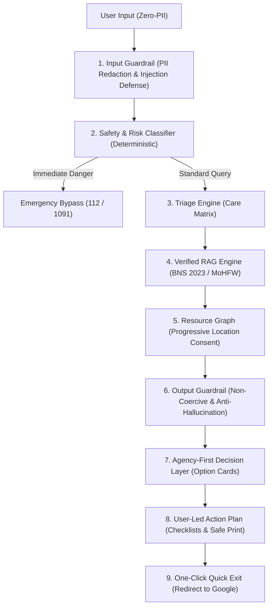

# SecuTrail (SECUTRAIL)

> **"Verified information. Private support. Your choice."**

[](https://nextjs.org/)
[](https://www.typescriptlang.org/)
[](https://secu-trail.vercel.app)
[](https://secu-trail.vercel.app/privacy)
[](https://github.com/kit29-25bad095/SecuTrail)
[](https://www.w3.org/WAI/standards-guidelines/wcag/)
[](LICENSE)

**SecuTrail** is a production-grade, privacy-first digital safety platform designed to provide verified information, decision support, and crisis resources for survivors of sexual assault and community supporters.

🌐 **Live Production URL:** [https://secu-trail.vercel.app](https://secu-trail.vercel.app)

SecuTrail is **not** an open-ended conversational chatbot. It is a deterministic, multi-layered decision architecture combining proactive prevention education with trauma-informed survivor triage, verified statutory knowledge grounding (RAG), and instant emergency Quick Exit.

---

## 🌟 Core Highlights & Architectural Features

### 1. 🔴 One-Click Quick Exit & Anti-Tracing System
- **Immediate Redirect to Google (`https://www.google.com`):** Wipes local visit traces and replaces the history stack via `window.location.replace()`, preventing the back button from returning to SecuTrail.
- **Selective Storage Cleanup:** Deletes only `secutrail_*` localStorage keys and all sessionStorage, preserving unrelated cookies so the browser doesn't look suspiciously emptied.
- **Dual Triggers:** Mouse click or double-pressing <kbd>Escape</kbd> within 1 second (<kbd>ESC</kbd> + <kbd>ESC</kbd>).
- **Asynchronous Invalidation:** Dispatches a non-blocking `navigator.sendBeacon` to `/api/session/exit` to terminate server RAM sessions without delaying the redirect.

### 2. 🛡️ Zero-PII & Ephemeral Memory Sessions
- **No Sign-Up or Authentication Required:** Zero user accounts, emails, passwords, or phone numbers are ever collected or stored.
- **RAM-Only Sessions:** Ephemeral session tokens expire automatically after 30 minutes of inactivity.
- **Salted HMAC Rate Limiting:** Client identifiers are hashed using a salted SHA-256 HMAC; raw client IP addresses are never recorded in logs or databases.
- **Transparent Threat Model:** Published at `/privacy` explaining technological limits (local browser history, router logs, screen snooping).

### 3. 📚 Awareness Track (`/awareness`)
- Structured, non-judgmental educational suite for students, educators, parents, and bystanders:
  - **Consent & Autonomy (`/awareness/consent`):** Clear standards of active consent, common myths, and statutory age of consent in India.
  - **Boundary Checks (`/awareness/boundaries`):** Personal, physical, emotional, and digital boundary self-assessments.
  - **Active Bystander Intervention (`/awareness/bystander-support`):** The 5Ds Active Bystander Model (*Direct, Distract, Delegate, Delay, Document*).
  - **Digital Safety & Evidence (`/awareness/digital-safety`):** Image-based abuse prevention, cyber stalking protections, and secure evidence collection.
  - **Support Navigation (`/awareness/get-help`):** Comprehensive guide to reporting mechanisms, ICCs, and national helplines.

### 4. 🕊️ Survivor Support Track (`/survivor`)
- **Safety & Risk Classifier (`/survivor/safety`):** Deterministic evaluation detecting `IMMEDIATE_DANGER`, `MEDICAL_URGENCY` (72-hour clinical window for HIV PEP), `EMOTIONAL_DISTRESS`, and `MINOR_INVOLVEMENT` (POCSO).
- **Care Triage Engine (`/survivor/triage`):** Multi-path selector allowing Medical, Emotional, and Legal paths to be explored individually or together, dynamically introducing One Stop Centres (Sakhi / OSC).
- **Grounded Verified RAG (`/survivor/assistant`):** Strictly constrained to statutorily vetted Indian legal and medical documentation (BNS 2023, MoHFW PEP Protocols, NALSA). Strictly refuses out-of-domain queries with a zero-hallucination guarantee.
- **Agency-First Decision Layer (`/survivor/options`):** Balanced option cards highlighting what happens, concrete benefits, trade-offs, and next steps under survivor control.
- **User-Led Action Plan (`/survivor/action`):** Self-paced checklists, forensic evidence preservation rules, and clean `@media print` safe-print styling.

---

## 🏛️ Architectural Pipeline



---

## ⚡ Quickstart

### Prerequisites
- Node.js 18+ (tested on Node.js v20+)
- npm or yarn

### 1. Installation
```bash
# Clone the repository
git clone https://github.com/kit29-25bad095/SecuTrail.git
cd secutrail

# Install dependencies
npm install

# Generate Prisma client
npx prisma generate
```

### 2. Environment Configuration
Copy the template configuration file:
```bash
cp .env.example .env
```
Default `.env` settings allow the application to run with zero external credentials:
- `NEXT_PUBLIC_QUICK_EXIT_URL="https://www.google.com"`
- `NEXT_PUBLIC_ENABLE_DEMO_MODE="true"`
- `RESOURCE_PROVIDER="demo"`
- `LLM_PROVIDER="mock"`

### 3. Run Locally
```bash
# Start development server
npm run dev

# Or build and launch the production server
npm run build
npm run start
```

Open [http://localhost:3000](http://localhost:3000) in your browser.

---

## 🧪 Quality Gates & Automated Testing

SecuTrail enforces strict automated quality gates. All 115 test cases pass cleanly:

```bash
# Run unit & integration test suites (72 tests)
npm test

# Run Step 3 20-Point Localhost Verification (27 tests)
npx tsx tests/step3-verification.test.ts

# Run E2E QA user journey suite (16 tests)
npx tsx tests/e2e-qa.test.ts

# Run TypeScript typecheck (0 errors)
npx tsc --noEmit

# Run ESLint (0 errors, 0 warnings)
npm run lint

# Verify production build (35 static & dynamic routes compiled)
npm run build
```

---

## 📞 Statutory 24/7 Helplines Integrated

SecuTrail integrates verified statutory emergency numbers across India:
- **112:** National Emergency Response Support System (ERSS - Police, Fire, Ambulance)
- **1091 / 181:** 24/7 Women Helplines
- **14416:** Tele-MANAS (MoHFW National Mental Health Helpline)
- **1098:** Childline (POCSO / Child Protection)
- **15100:** NALSA Free Legal Services Authority

---

## 📄 License & Attribution

SecuTrail is open-source software licensed under the [MIT License](LICENSE).
Developed with a survivor-centered, trauma-informed, and agency-first methodology.
