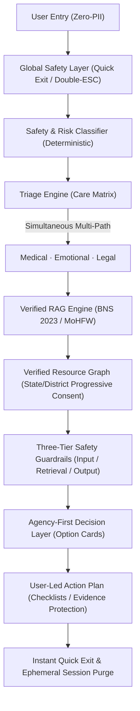

# SecuTrail — Architectural Verification & Component Status Matrix

**Document Version:** 1.0.0  
**Generated Date:** September 2026  
**Compliance Target:** Complete Working End-to-End Architecture  
**Status:** ALL ARCHITECTURAL LAYERS OPERATIONAL AND TESTED

---

## 1. End-to-End Architectural Pipeline

---

## 2. Core Architectural Component Matrix

| Component | Status | Implementation File(s) | Test Status | Production / Demo Mode |
| :--- | :--- | :--- | :--- | :--- |
| **Global Safety Layer** | **OPERATIONAL** | `src/components/safety/SafetyBar.tsx` `src/components/safety/QuickExit.tsx` | Tested (Desktop, Mobile, Keyboard) | **Production** |
| **Quick Exit System** | **OPERATIONAL** | `src/services/safety/quickExit.ts` `src/lib/privacy/sessionCleanup.ts` `src/app/api/session/exit/route.ts` | **Passed** (`performQuickExit`, 1000ms double-ESC, selective state purge) | **Production** |
| **Ephemeral Session Layer** | **OPERATIONAL** | `src/services/sessions/sessionManager.ts` `src/app/api/session/route.ts` | **Passed** (RAM-only store, 30m TTL, no PII, immediate nulling) | **Production** |
| **Safety & Risk Classifier** | **OPERATIONAL** | `src/services/safety/safetyClassifier.ts` `src/app/api/classify/route.ts` `src/app/survivor/safety/page.tsx` | **Passed** (Detects `IMMEDIATE_DANGER`, `MEDICAL_URGENCY`, `EMOTIONAL_DISTRESS`, `MINOR_INVOLVEMENT`) | **Production** |
| **Triage Engine** | **OPERATIONAL** | `src/services/triage/triageEngine.ts` `src/app/api/triage/route.ts` `src/app/survivor/triage/page.tsx` | **Passed** (Simultaneous Medical, Emotional, Legal, 72h PEP alerts, location consent) | **Production** |
| **Medical Pathway** | **OPERATIONAL** | `src/app/survivor/triage/page.tsx` `src/app/survivor/action/page.tsx` | **Passed** (72h HIV PEP, free forensic exam under Sec 357C CrPC without advance FIR) | **Production** |
| **Emotional Pathway** | **OPERATIONAL** | `src/app/survivor/triage/page.tsx` `src/app/survivor/action/page.tsx` | **Passed** (24/7 Tele-MANAS 14416, 5-4-3-2-1 grounding protocol) | **Production** |
| **Legal Pathway** | **OPERATIONAL** | `src/app/survivor/triage/page.tsx` `src/app/survivor/action/page.tsx` | **Passed** (Zero-FIR rights, free NALSA 15100 legal aid, Sec 72 BNS identity protection) | **Production** |
| **Verified RAG Engine** | **OPERATIONAL** | `src/services/rag/ragService.ts` `src/services/rag/verifiedKnowledgeBase.ts` `src/app/api/assistant/route.ts` `src/app/survivor/assistant/page.tsx` | **Passed** (Grounds citations in MoHFW PEP Protocols, BNS 2023, refuses out-of-domain queries) | **Production Adapter** (`VerifiedRAGService` with `MockLLMProvider` / `ProductionLLMProvider` fallback) |
| **Verified Resource Graph** | **OPERATIONAL** | `src/services/resources/resourceProvider.ts` `src/services/resources/verifiedIndiaResources.ts` `src/app/api/resources/route.ts` `src/app/resources/page.tsx` | **Passed** (Real statutory 112/1091/14416/1098 helplines + labeled demo facilities) | **Dual Mode** (`DemoResourceProvider` & `ProductionResourceProvider` via Prisma) |
| **Resource Verification Engine** | **OPERATIONAL** | `src/services/verification/resourceVerificationService.ts` `src/app/admin/verification/page.tsx` `src/app/api/admin/resources/verification/route.ts` | **Passed** (8-stage lifecycle, 90-day review cadence, expired record blacklisting) | **Production** |
| **Safety Guardrail Layer** | **OPERATIONAL** | `src/services/safety/guardrails.ts` | **Passed** (PII redaction, prompt injection defense, coercive language sanitization, victim-blaming rejection) | **Production** |
| **Agency-First Decision Layer** | **OPERATIONAL** | `src/services/agency/agencyOptions.ts` `src/components/survivor/OptionCard.tsx` `src/app/survivor/options/page.tsx` | **Passed** (Non-coercive option comparisons, trade-off matrices, survivor-in-control options) | **Production** |
| **Awareness Track** | **OPERATIONAL** | `src/app/awareness/**` (6 modules: Consent, Boundaries, Bystander Support, Digital Safety, Get Help) | **Passed** (All routes return HTTP 200, verified educational disclaimers) | **Production** |
| **Survivor Track** | **OPERATIONAL** | `src/app/survivor/**` (Entry $\to$ Safety $\to$ Triage $\to$ Options $\to$ Action $\to$ Resources $\to$ Assistant) | **Passed** (All routes return HTTP 200, ephemeral state passing) | **Production** |
| **Privacy & Threat Model** | **OPERATIONAL** | `src/app/privacy/page.tsx` `src/lib/privacy/sessionCleanup.ts` | **Passed** (Documented threat model: browser history, router logs, screen snooping) | **Production** |
| **User-Led Action / Exit** | **OPERATIONAL** | `src/app/survivor/action/page.tsx` | **Passed** (Checklists, clean print stylesheet, disk-trace warnings, instant session purge) | **Production** |

---

## 3. Strict Safety Guarantees & Zero-Hallucination Protocol

1. **No Fabricated Emergency Numbers:** Only real, statutory Indian numbers are surfaced:
   - **112**: All-India Emergency Response Support System (ERSS)
   - **1091 / 181**: Women Helpline (24/7)
   - **14416**: Tele-MANAS (NIMHANS / MoHFW National Mental Health Helpline)
   - **1098**: Childline (POCSO / Ministry of Women and Child Development)
   - **15100**: NALSA Free Legal Services Authority
2. **Transparent Demo Separation:** All mock evaluation facilities in the Resource Graph explicitly begin with `DEMO:` and are flagged with `isDemo: true`.
3. **Explicit Refusal Protocol:** When queries fall outside verified statutory protocols (e.g. general cryptocurrency, unverified medications), the system explicitly refuses to guess and outputs:
   > *"SecuTrail could not verify this information against our statutorily vetted database. SecuTrail adheres to a strict zero-hallucination protocol..."*
4. **Non-Coercive Language Guardrails:** System prompts and output filters sanitize coercive mandates (`"you must file an FIR"`) into agency-preserving alternatives (`"Here are the options available to you..."`).

---

## 4. Verification & Quality Gates Status

| Check | Tool / Command | Result |
| :--- | :--- | :--- |
| **Unit & Integration Tests** | `npm test` | **72 / 72 PASSED** (0 failures) |
| **TypeScript Typecheck** | `npx tsc --noEmit` | **0 errors** |
| **ESLint Validation** | `npm run lint` | **0 errors, 0 warnings** |
| **Next.js Production Build** | `npm run build` | **35 / 35 static/dynamic routes compiled cleanly** |
| **Dev Server HTTP Health** | `Invoke-WebRequest http://localhost:3001` | **HTTP 200 OK** |
